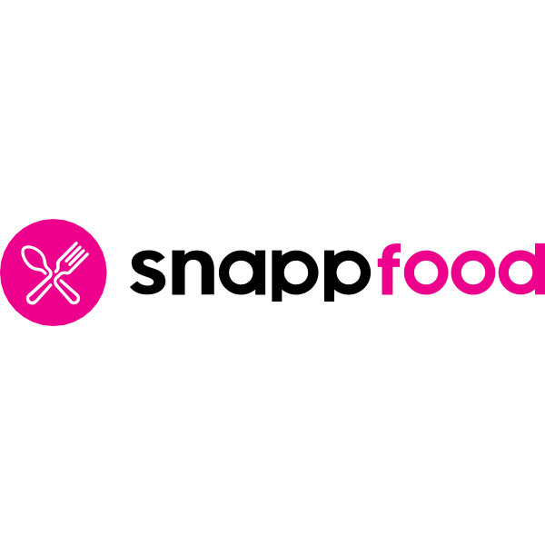

## Snap Food

Snap food project is a web application which designs and implements a simple delivery system. There are plenty of entities such as Vendor, Agent, Order, Trip, etc. 

## Installation

- make sure you have git and docker installed
- git clone project from [https://github.com/mina-101/snap-food.git]
- cd snap-food/
- run docker-compose up -d
- docker exec -it snap-food-laravel.test-1 bash
- php artisan migrate

## Run Tests

- docker exec -it snap-food-laravel.test-1 bash
- php artisan test

